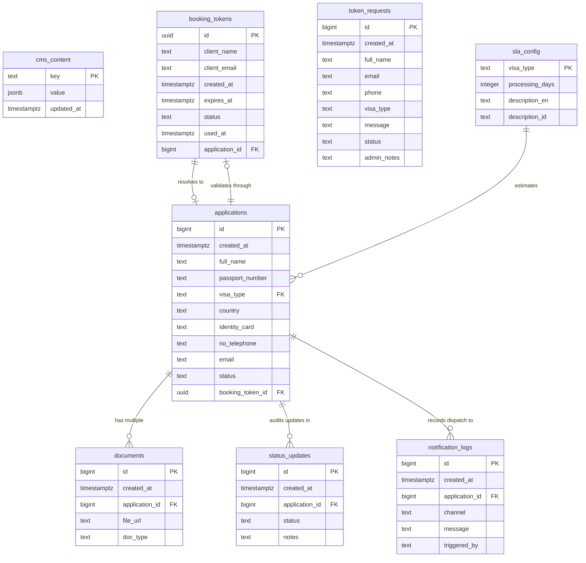
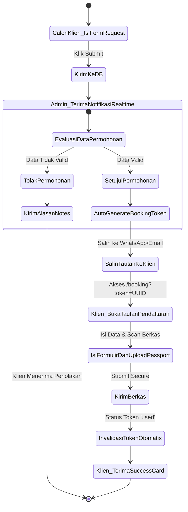
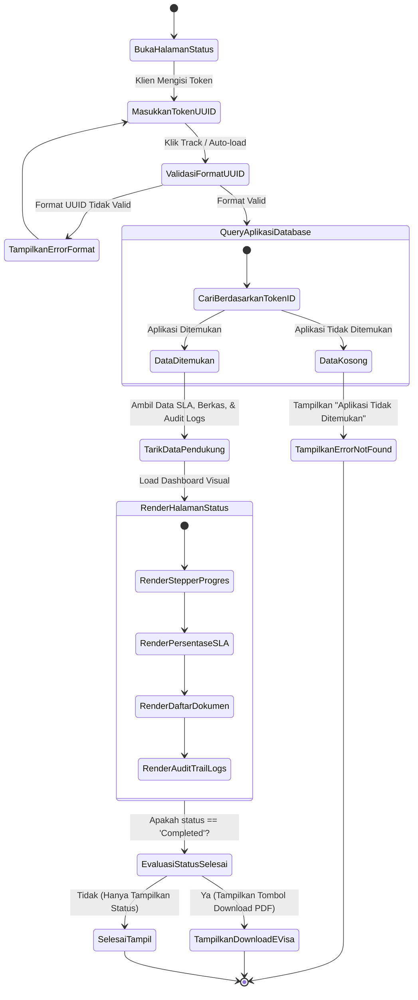

# DOKUMENTASI AKADEMIK & ARSITEKTUR N-IMS
## Sistem Informasi Manajemen Imigrasi — PT. Karsa Ruang Nusantara (NUKARSA)
*Laporan Rekayasa Perangkat Lunak & Basis Data (Standar Kerja Praktek / Tugas Akhir)*

---

### 1. Landasan Sistem
Sistem Informasi Manajemen Imigrasi Nukarsa (**N-IMS**) dirancang untuk mendigitalisasi, mengamankan, dan mempercepat alur manajemen berkas keimigrasian (Visa, KITAS, Legalitas Korporasi) bagi ekspatriat asing di Indonesia. Sistem ini mengintegrasikan portal pelayanan publik klien mandiri dengan Pusat Komando Admin secara real-time.

---

### 2. Diagram Hubungan Entitas (ERD - Entity Relationship Diagram)

ERD di bawah menggambarkan hubungan relasional antar **8 entitas** dalam basis data N-IMS secara komprehensif (tanpa entitas pembayaran).



---

### 3. Struktur Relasi Logis (LRS - Logical Record Structure)

LRS merepresentasikan skema relasional tabel pasca-normalisasi tingkat ketiga (3NF) dengan identifikasi kunci primer (*Primary Key*) dan kunci tamu (*Foreign Key*):

1. **`public.cms_content`**  
   `[key (PK: text) | value (jsonb) | updated_at (timestamptz)]`
   
2. **`public.sla_config`**  
   `[visa_type (PK: text) | processing_days (integer) | description_en (text) | description_id (text)]`

3. **`public.booking_tokens`**  
   `[id (PK: uuid) | client_name (text) | client_email (text) | created_at (timestamptz) | expires_at (timestamptz) | status (text) | used_at (timestamptz) | application_id (FK -> public.applications.id)]`

4. **`public.applications`**  
   `[id (PK: bigint, identity) | created_at (timestamptz) | full_name (text) | passport_number (text) | visa_type (FK -> public.sla_config.visa_type) | country (text) | identity_card (text) | no_telephone (text) | email (text) | status (text) | booking_token_id (FK -> public.booking_tokens.id)]`

5. **`public.documents`**  
   `[id (PK: bigint, identity) | created_at (timestamptz) | application_id (FK -> public.applications.id) | file_url (text) | doc_type (text)]`

6. **`public.status_updates`**  
   `[id (PK: bigint, identity) | created_at (timestamptz) | application_id (FK -> public.applications.id) | status (text) | notes (text)]`

7. **`public.token_requests`**  
   `[id (PK: bigint, identity) | created_at (timestamptz) | full_name (text) | email (text) | phone (text) | visa_type (text) | message (text) | status (text) | admin_notes (text)]`

8. **`public.notification_logs`**  
   `[id (PK: bigint, identity) | created_at (timestamptz) | application_id (FK -> public.applications.id) | channel (text) | message (text) | triggered_by (text)]`

---

### 4. Struktur Kamus Basis Data (Data Dictionary)

Berikut adalah dekomposisi struktural field penyusun basis data:

#### Tabel `booking_tokens`
| Nama Field | Tipe Data | Constraint | Keterangan |
|---|---|---|---|
| `id` | uuid | PRIMARY KEY | ID unik token undangan sekali pakai (UUID) |
| `client_name` | text | NOT NULL | Nama klien penerima token |
| `client_email`| text | NULL | Alamat email tujuan token |
| `created_at` | timestamptz| DEFAULT now() | Stempel waktu token diterbitkan |
| `expires_at` | timestamptz| NOT NULL | Tenggat kedaluwarsa token (Default 7 hari) |
| `status` | text | CHECK (active, used, expired) | Status validitas token pendaftaran |
| `used_at` | timestamptz| NULL | Stempel waktu token diklaim oleh klien |
| `application_id`| bigint | REFERENCES applications(id) | ID aplikasi yang terasosiasi setelah token diklaim |

#### Tabel `applications`
| Nama Field | Tipe Data | Constraint | Keterangan |
|---|---|---|---|
| `id` | bigint | PRIMARY KEY, IDENTITY | ID aplikasi registrasi visa pemohon |
| `created_at` | timestamptz| DEFAULT now() | Waktu pengiriman registrasi berkas |
| `full_name` | text | NOT NULL | Nama lengkap pemohon asing |
| `passport_number`| text | NOT NULL | Nomor paspor aktif |
| `visa_type` | text | NOT NULL | Jenis pengurusan visa/KITAS |
| `country` | text | NULL | Negara asal pemohon |
| `identity_card`| text | NULL | Nomor kartu identitas nasional |
| `no_telephone`| text | NULL | Nomor telepon pemohon (WhatsApp) |
| `email` | text | NULL | Alamat email aktif klien |
| `status` | text | CHECK (Pending, Verified, In Progress, Completed, Rejected) | Tahap status pemrosesan keimigrasian |
| `booking_token_id`| uuid | REFERENCES booking_tokens(id) | ID token undangan sekali pakai penjamin |

#### Tabel `token_requests`
| Nama Field | Tipe Data | Constraint | Keterangan |
|---|---|---|---|
| `id` | bigint | PRIMARY KEY, IDENTITY | ID permohonan token calon klien mandiri |
| `created_at` | timestamptz| DEFAULT now() | Waktu pengajuan formulir publik |
| `full_name` | text | NOT NULL | Nama lengkap pemohon |
| `email` | text | NOT NULL | Alamat email calon pemohon |
| `phone` | text | NULL | Nomor WhatsApp calon pemohon |
| `visa_type` | text | NULL | Jenis visa yang diminati pemohon |
| `message` | text | NULL | Pesan konteks kebutuhan keimigrasian |
| `status` | text | CHECK (Pending, Approved, Rejected) | Status persetujuan administrasi |
| `admin_notes` | text | NULL | Umpan balik penolakan / tautan token approved |

---

### 5. Diagram Use Case UML

Aktor utama yang berinteraksi dengan N-IMS adalah **Calon Klien**, **Klien Terdaftar**, dan **Administrator**:

```mermaid
usecaseDiagram
    actor "Calon Klien" as CalonKlien
    actor "Klien Terdaftar" as KlienTerdaftar
    actor "Administrator" as Admin

    rectangle N-IMS {
        usecase "Mengisi Form Permintaan Token (/request)" as UC1
        usecase "Melakukan Upload Berkas & Passport (/booking)" as UC2
        usecase "Melacak Status Visa & SLA (/status)" as UC3
        
        usecase "Login Autentikasi Admin Center" as UC5
        usecase "Mengelola Permohonan Masuk (Approve/Reject Token)" as UC6
        usecase "Menerbitkan Token Undangan Sekali Pakai" as UC7
        usecase "Memperbarui Status Visa & Catatan Riwayat" as UC8
        usecase "Melihat Notifikasi Log Audits" as UC10
    }

    CalonKlien --> UC1
    CalonKlien --> UC3
    
    KlienTerdaftar --> UC2
    KlienTerdaftar --> UC3

    Admin --> UC5
    Admin --> UC6
    Admin --> UC7
    Admin --> UC8
    Admin --> UC10
```

---

### 6. Diagram Aktivitas UML (Activity Diagram)

#### 6.1 Alur Pengajuan Token Mandiri & Pendaftaran Berkas
Diagram di bawah mendeskripsikan aktivitas Calon Klien mengajukan permohonan token, divalidasi oleh Admin, hingga Klien terdaftar sukses mengunggah berkas.



#### 6.2 Alur Lacak Tracking Status Pengajuan Mandiri
Menggambarkan aktivitas Klien dalam melakukan pengecekan status pengajuan visa menggunakan token unik.



---

### 7. Diagram Sekuensial UML (Sequence Diagram)

#### 7.1 Skenario Lacak Status & SLA Pengajuan Klien
Menggambarkan interaksi sekuensial antara browser Klien, API server Next.js, dan penyimpanan data Supabase saat memuat status (tanpa tagihan).

```mermaid
sequenceDiagram
    autonumber
    actor Klien
    participant Browser as Browser Klien (/status)
    participant NextJS as Next.js API / Router
    participant DB as Supabase PostgreSQL

    Klien->>Browser: Masukkan UUID Booking Token
    Browser->>NextJS: Query Data Aplikasi (token_uuid)
    NextJS->>DB: SELECT * FROM applications WHERE booking_token_id = token_uuid
    DB-->>NextJS: Mengembalikan Data Aplikasi (full_name, status, visa_type, id)
    
    rect rgb(15, 23, 42)
        Note over NextJS, DB: Pengambilan Informasi SLA, Dokumen, & Logs
        NextJS->>DB: SELECT * FROM sla_config WHERE visa_type = app.visa_type
        DB-->>NextJS: SLA Data (processing_days, description)
        NextJS->>DB: SELECT * FROM documents WHERE application_id = app.id
        DB-->>NextJS: Daftar Berkas Terunggah (file_url, doc_type)
        NextJS->>DB: SELECT * FROM status_updates WHERE application_id = app.id ORDER BY created_at DESC
        DB-->>NextJS: Jejak Riwayat Log Audit Status
    end

    NextJS-->>Browser: Komposisi Respon JSON Data Terpadu
    Browser-->>Klien: Merender Stepper Progres, Progress Bar SLA, Dokumen, & Riwayat Log Status
```



---

### 8. Desain Wireframe Sistem

#### 8.1 Public Client Status Tracker Portal (`/status`)
```
+--------------------------------------------------------------------------------+
|  NUKARSA LOGO                                                        [ID] [EN] |
+--------------------------------------------------------------------------------+
|                                                                                |
|                           TRACK APPLICATION STATUS                             |
|           Enter Booking Token ID to monitor immigration files in real-time.     |
|                                                                                |
|   +-------------------------------------------------------------+  +--------+  |
|   | Enter Booking Token ID (UUID) e.g. f81d4fae-7dec-11d0...    |  | TRACK  |  |
|   +-------------------------------------------------------------+  +--------+  |
|                                                                                |
|   +-------------------------------------------------------------------------+  |
|   | APPLICATION STATUS CARD                                                 |  |
|   | Applicant Name: John Doe                  Country: Germany              |  |
|   | Visa Type: Working KITAS (E23)            Current Status: [IN PROGRESS] |  |
|   |                                                                         |  |
|   | Visual Pipeline:                                                        |  |
|   | (1) PENDING [✓] ---> (2) VERIFIED [✓] ---> (3) IN PROGRESS [●] ---> COMP|  |
|   |                                                                         |  |
|   | SLA Processing Estimate: 30 Days Total                                  |  |
|   | [============================>----------------------------------------] |  |
|   | 12 Days Elapsed                             18 Days Remaining           |  |
|   +-------------------------------------------------------------------------+  |
|                                                                                |
|   +-------------------------------------------------------------------------+  |
|   | 📂 UPLOADED DOCUMENTS                                                   |  |
|   | - Scan Passport_John.pdf                                                |  |
|   | - NationalID_German.png                                                 |  |
|   +-------------------------------------------------------------------------+  |
|                                                                                |
+--------------------------------------------------------------------------------+
```

---

### 9. Panduan UI/UX Premium N-IMS

N-IMS menerapkan pedoman UI/UX dengan estetika tinggi (*high-fidelity visuals*) guna menyajikan pengalaman premium bagi korporasi dan ekspatriat asing kelas atas:

*   **Palet Warna Premium (Modern Dark Slate theme):**
    *   *Deep Background:* Slate gelap murni (`#020617` / `slate-950`) yang menghapus saturasi silau dan memberikan kenyamanan mata.
    *   *Brand Accent Light:* Blue Elektrik HSL (`#2563eb` / `blue-600`) sebagai representasi teknologi tinggi keimigrasian yang andal.
    *   *Vibrant Accents:* Emerald Hijau untuk tanda sukses, Ambar Kuning untuk status tunggu, dan Crimson Red untuk kegagalan/penolakan berkas.
*   **Prinsip Desain Glassmorphism:**  
    Setiap panel kartu menggunakan efek translusen dengan latar belakang kabur (*backdrop blur*) sebesar `16px` (`backdrop-blur-xl`), dilapisi oleh warna semi-transparan `slate-900/40`, dan dibatasi garis tepi halus transparan `border-slate-800`. Skema ini memberikan kedalaman dimensi dinamis (*z-axis depth*).
*   **Tipografi Modern:**  
    Sistem menggunakan font sans-serif **Inter** dan **Outfit** yang dimuat dinamis dari Google Fonts. Kontras hirarki teks dijaga ketat: ukuran `text-3xl` dengan berat `font-black` untuk judul halaman utama, `text-xs` tebal dengan `letter-spacing` renggang (`tracking-widest`) untuk label input, dan `font-mono` terpisah untuk ID angka serta UUID.
*   **Micro-Animations & Responsive Layouts:**  
    Setiap tombol aksi memicu transisi skala halus saat disentuh (`active:scale-[0.98]`). Skema grid responsif tiga kolom melipat secara dinamis ke satu kolom vertikal di ponsel, menjamin kenyamanan akses melalui layar sentuh seluler terkecil sekalipun.
