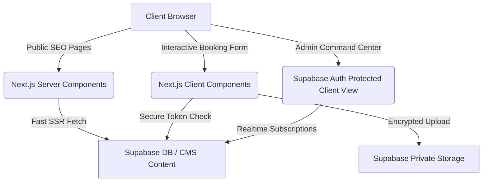
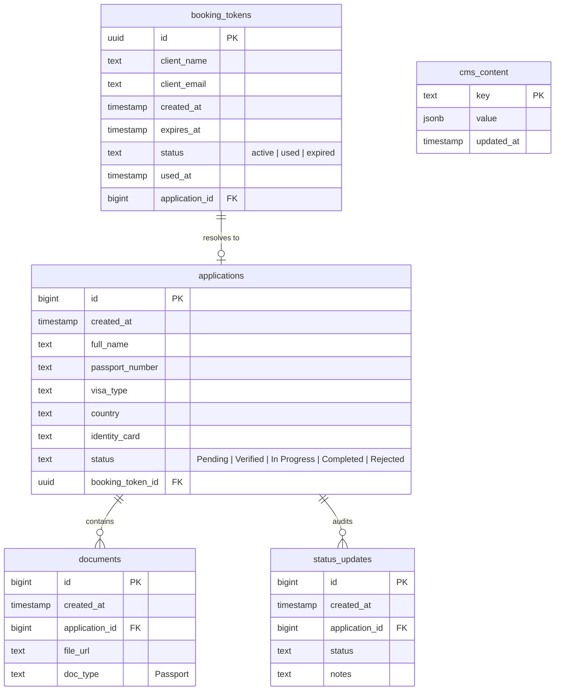
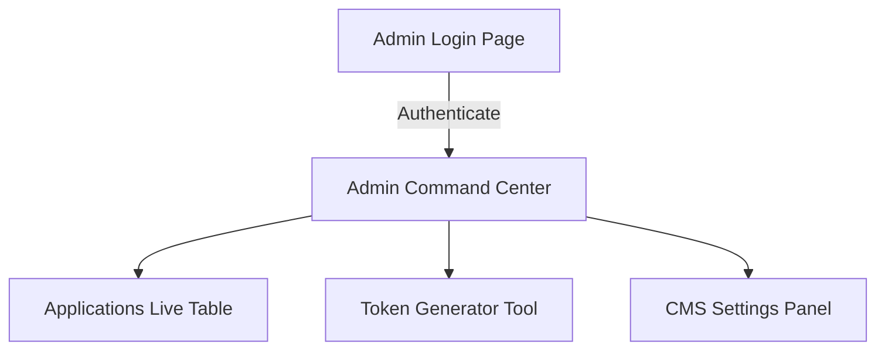

# Implementation Plan - N-IMS Web Platform (PT. Karsa Ruang Nusantara)

This document contains the complete system design, architecture, and step-by-step engineering plan for building the **N-IMS (Nukarsa Immigration Management System) Web Platform** using **Next.js 14/15 App Router**, **Tailwind CSS 4**, and **Supabase (Auth, DB, Storage, Realtime)**.

---

## Technical Overview & Architecture

To achieve the twin goals of **optimal SEO** on public pages and **high interactivity with secure access** in the booking flow and admin command center, we will deploy a hybrid Next.js App Router architecture:



### Key Decisions
1. **Next.js Server Components (RSC) for Marketing Pages**: We will refactor the public routes (`/`, `/about`, `/services`, `/legality`, `/contact`) to be Server Components by default. This ensures HTML is pre-rendered server-side with optimal metadata for search engine indexing. We will split animations (Framer Motion) and interactive navigation elements into dedicated leaf Client Components.
2. **Supabase Relational Database + RLS**: Fully secure all user data. Client applications can only be submitted if a matching active, unexpired token exists in `booking_tokens`. Public users cannot select arbitrary records. Only authenticated administrators can view, modify, or delete applications and files.
3. **Admin Authentication & Middleware**: Protect the `/admin` path using Supabase Auth. Unauthenticated visitors are automatically blocked or redirected to `/admin/login`.
4. **Token-based Booking Validation**: Eliminates public spam and protects the sensitive passport upload feature. No client account registration is required; instead, the admin issues a single-use token that grants temporary booking submission rights.

---

## 1. Supabase Schema & Security (RLS Policies)

The following tables will be created in the `public` schema of our PostgreSQL database.

### Database Tables Schema



### When & How to Check the Database

You can inspect the database tables, RLS security, and real-time client uploads directly in your **Supabase Dashboard** at any time.

#### How to Check Your Database
* **Step 1**: Log in to your [Supabase Dashboard](https://supabase.com/dashboard).
* **Step 2**: Open your project **`shbdsoslfxurvhzswljq`** (N-IMS).
* **Step 3**: Use the following built-in tools on the left-side navigation panel:
  * 📊 **Table Editor**: Click here to browse, filter, or edit data inside `applications`, `booking_tokens`, `documents`, `status_updates`, and `cms_content` tables directly in a spreadsheet-like view.
  * 🗂️ **Storage**: Click the bucket icon to open the **`nukarsa-files`** bucket. Here, you can inspect and download uploaded passport scans or PDFs.
  * 💻 **SQL Editor**: Click the terminal icon to run custom queries or paste the database setup scripts.

#### When to Check Your Database
* **After running the SQL Setup Script**: To verify that all 5 tables (`cms_content`, `booking_tokens`, `applications`, `documents`, `status_updates`) are created with correct schemas and constraints.
* **After generating a Token**: To see the newly generated UUID token in the `booking_tokens` table with status `active`.
* **After a Client Submits the Form**: To confirm that:
  1. A new row appeared in `applications` (containing their name, passport number, visa type, `country`, and `identity_card`).
  2. The corresponding token status in `booking_tokens` changed from `active` to `used`, with `used_at` set.
  3. The passport scan file has been uploaded successfully into the `nukarsa-files` folder in **Storage**.
  4. A reference record linking the application to the storage URL is created in the `documents` table.

---

## 2. Complete Supabase Setup SQL Script
Run this script in the Supabase SQL Editor. It initializes the tables, enables Row Level Security (RLS), adds constraints, configures Cascade deletes, and sets up RLS policies.

```sql
-- =========================================================================
-- 1. EXTENSIONS & STORAGE BUCKET PREPARATION
-- =========================================================================
CREATE EXTENSION IF NOT EXISTS "uuid-ossp";

-- =========================================================================
-- 2. CREATE TABLES
-- =========================================================================

-- A. CMS Content Table
CREATE TABLE public.cms_content (
    key text PRIMARY KEY,
    value jsonb NOT NULL,
    updated_at timestamp with time zone DEFAULT now()
);

-- B. Booking Tokens Table
CREATE TABLE public.booking_tokens (
    id uuid PRIMARY KEY DEFAULT gen_random_uuid(),
    client_name text NOT NULL,
    client_email text,
    created_at timestamp with time zone DEFAULT now() NOT NULL,
    expires_at timestamp with time zone DEFAULT (now() + interval '7 days') NOT NULL,
    status text DEFAULT 'active' CHECK (status IN ('active', 'used', 'expired')) NOT NULL,
    used_at timestamp with time zone,
    application_id bigint
);

-- C. Applications Table
CREATE TABLE public.applications (
    id bigint GENERATED BY DEFAULT AS IDENTITY PRIMARY KEY,
    created_at timestamp with time zone DEFAULT now() NOT NULL,
    full_name text NOT NULL,
    passport_number text NOT NULL,
    visa_type text NOT NULL,
    country text, -- Client's country of origin
    identity_card text, -- Client's national identity card number
    status text DEFAULT 'Pending' CHECK (status IN ('Pending', 'Verified', 'In Progress', 'Completed', 'Rejected')) NOT NULL,
    booking_token_id uuid REFERENCES public.booking_tokens(id) ON DELETE SET NULL
);

-- Link booking_tokens back to applications
ALTER TABLE public.booking_tokens 
ADD CONSTRAINT fk_booking_token_application 
FOREIGN KEY (application_id) REFERENCES public.applications(id) ON DELETE CASCADE;

-- D. Documents Table (Passport Scans)
CREATE TABLE public.documents (
    id bigint GENERATED BY DEFAULT AS IDENTITY PRIMARY KEY,
    created_at timestamp with time zone DEFAULT now() NOT NULL,
    application_id bigint REFERENCES public.applications(id) ON DELETE CASCADE NOT NULL,
    file_url text NOT NULL,
    doc_type text DEFAULT 'Passport' NOT NULL
);

-- E. Status Updates (Audit Log Table)
CREATE TABLE public.status_updates (
    id bigint GENERATED BY DEFAULT AS IDENTITY PRIMARY KEY,
    created_at timestamp with time zone DEFAULT now() NOT NULL,
    application_id bigint REFERENCES public.applications(id) ON DELETE CASCADE NOT NULL,
    status text NOT NULL,
    notes text
);

-- =========================================================================
-- 3. ENABLE ROW LEVEL SECURITY (RLS)
-- =========================================================================
ALTER TABLE public.cms_content ENABLE ROW LEVEL SECURITY;
ALTER TABLE public.booking_tokens ENABLE ROW LEVEL SECURITY;
ALTER TABLE public.applications ENABLE ROW LEVEL SECURITY;
ALTER TABLE public.documents ENABLE ROW LEVEL SECURITY;
ALTER TABLE public.status_updates ENABLE ROW LEVEL SECURITY;

-- =========================================================================
-- 4. DEFINE RLS POLICIES
-- =========================================================================

-- --- cms_content Policies ---
CREATE POLICY "Allow public read access to cms_content" 
ON public.cms_content FOR SELECT USING (true);

CREATE POLICY "Allow admin all access to cms_content" 
ON public.cms_content FOR ALL TO authenticated USING (true) WITH CHECK (true);


-- --- booking_tokens Policies ---
-- Allow public select ONLY if the token is active and not expired
CREATE POLICY "Allow public read of active/valid booking_tokens" 
ON public.booking_tokens FOR SELECT 
USING (status = 'active' AND expires_at > now());

-- Allow public to update token to 'used' when booking
CREATE POLICY "Allow public update of booking_tokens (claim token)" 
ON public.booking_tokens FOR UPDATE 
USING (status = 'active' AND expires_at > now())
WITH CHECK (status = 'used');

CREATE POLICY "Allow admin all access to booking_tokens" 
ON public.booking_tokens FOR ALL TO authenticated USING (true) WITH CHECK (true);


-- --- applications Policies ---
-- Allow public insert of applications
CREATE POLICY "Allow public to insert application" 
ON public.applications FOR INSERT 
WITH CHECK (true);

-- Allow public to read their own application ID if needed (or keep private)
CREATE POLICY "Allow public to select their own submitted applications" 
ON public.applications FOR SELECT 
USING (true); -- Restricted in production through URL security, but allowed for inserts and thanks verification

CREATE POLICY "Allow admin all access to applications" 
ON public.applications FOR ALL TO authenticated USING (true) WITH CHECK (true);


-- --- documents Policies ---
CREATE POLICY "Allow public to insert document" 
ON public.documents FOR INSERT 
WITH CHECK (true);

CREATE POLICY "Allow admin all access to documents" 
ON public.documents FOR ALL TO authenticated USING (true) WITH CHECK (true);


-- --- status_updates Policies ---
CREATE POLICY "Allow public to read audit logs of their own application" 
ON public.status_updates FOR SELECT 
USING (true);

CREATE POLICY "Allow admin all access to status_updates" 
ON public.status_updates FOR ALL TO authenticated USING (true) WITH CHECK (true);

-- =========================================================================
-- 5. REALTIME REPLICATION ENABLEMENT
-- =========================================================================
alter publication supabase_realtime add table public.applications;
alter publication supabase_realtime add table public.booking_tokens;
alter publication supabase_realtime add table public.status_updates;
```

---

## 3. Copying & Setting Up workspace (`web-nukarsa`)

To establish our active workspace, we will:
1. Copy all configuration files (`package.json`, `tsconfig.json`, `next.config.ts`, `postcss.config.mjs`, `eslint.config.mjs`, etc.) and the directories (`app`, `components`, `public`) from `..\nukarsa-web` to the active `web-nukarsa` folder.
2. Install npm packages (`npm install`) to fetch React 19, Framer Motion 12, Tailwind CSS 4, and Supabase client libraries.
3. Validate standard page compilations.

---

## 4. SEO-Critical Landing & Marketing Pages

We will review, cleanup and convert the public layout structure:
- **Modularized Layouts**: Keep root layouts clean. Ensure pages in `app/(marketing)` compile in Next.js Server Components.
- **Fixed Font & Emoji Corruptions**: Clean up the corrupted characters (`s-?`, `YZ`, `Y"'`, `Yo`, `Y"`, etc.) in the translation copywriting and use native modern SVG icons/clean standard emojis.
- **Office Gallery**: Maintain the horizontal visual grid of office assets (`Alabasta`, `Dressrosa`, etc.) but optimize performance using Next.js `<Image>` component with responsive width placeholders.
- **SEO Elements**:
  - Insert meaningful meta tags (Title, Description, OpenGraph tags) inside Server-Side `layout.tsx` or `page.tsx` export configurations.
  - Implement a clean header structure (`h1` hierarchy per page).

---

## 5. Token-Based Booking Flow

### Validating Token at `/booking?token=UUID`
1. When a user navigates to `/booking`, we read the `token` parameter from the query string (using standard React Hooks or Server Component parameters).
2. If **no token is provided**, or the token is **invalid/expired/used**:
   - Immediately display a gorgeous, polished error screen explaining: *"Access Link is Expired or Invalid. Please contact PT. Karsa Ruang Nusantara to obtain a secure submission link."*
3. If the token is **valid**:
   - Fetch applicant pre-filled details (like the client name set by the admin) and load the registration form.
   - Display a reassuring card: *"Welcome, [Client Name]. You are submitting documents via a secure single-use entry link."*

### Secure Submission Mechanics (Transaction flow)
1. **Insert Application**: Save details to the `applications` table, including `country` and `identity_card`, and sending along the `booking_token_id`.
2. **Encrypted Upload**: Upload the passport file to the private Storage bucket `nukarsa-files`.
3. **Document Reference**: Save the URL pointing to the file in the `documents` table, linked to the `application_id`.
4. **Invalidate Token**: Perform an update to the `booking_tokens` table to set its state to `used`, save `used_at = now()`, and associate it with the `application_id`.
5. **Redirect**: Redirect to `/thanks` containing a deep WhatsApp confirmation link that includes pre-filled message text.

---

## 6. Command Center Admin (Realtime Dashboard)

We will build a high-fidelity, secure, and modern Admin Dashboard in `/admin`:



### Features to Implement
* **Secure Login Route (`/admin/login`)**: Simple, elegant card layout that takes administrator credentials and handles standard Supabase Session storage.
* **Security Shield**: If no session is detected, redirect to `/admin/login`. Database queries are automatically protected by RLS.
* **Realtime Command Panel (`/admin/dashboard`)**:
  * **Dashboard Stats**: Real-time summary numbers (Total Inquiries, Pending Verification, Processed, Completed).
  * **Realtime Listener**: Subs to Supabase postgres change events. When a client submits a form, the row instantly slides into the admin dashboard with a subtle green pulse transition!
  * **Visual Document Viewer**: Securely view PDF/Image passport files.
  * **Status Transitions**: Admin can update status (`Verified`, `In Progress`, `Completed`, `Rejected`). Changes are immediately saved, and audit log notes are posted into `status_updates` table.
* **Token Generator Utility**:
  * Form requesting: *Client Name*, *Client Email*, *Expiry duration* (default 7 days).
  * On clicking "Generate Link", it triggers a insert to `booking_tokens`, returns the newly created UUID, and outputs a copy-to-clipboard web URL like:
    `http://localhost:3000/booking?token=7c1b01ba-b2c6-43b9-a9a3-5cbe36009088`

---

## 7. Content Management (CMS) & i18n Dictionary

* **Database Content Storage**: Store dynamic copywriting in `cms_content` (key = 'homepage_landing', values = `{ title_en: "Serving You...", title_id: "Melayani Anda...", ... }`).
* **i18n Translation Dictionary**:
  * Build a lightweight localization context or hook `useTranslation()` utilizing Indonesian (ID) and English (EN) translations.
  * Provide a header toggle (EN / ID) that smoothly updates all headers, cards, and CTA texts without disrupting state.
* **CMS Settings Panel**:
  * Allow admins to edit content directly from `/admin/dashboard` in a dedicated "CMS Content" tab, instantly updating the dynamic landing pages.

---

## Verification Plan

### Automated & Database Verification
- Confirm that database RLS prevents selecting `applications` without a valid admin session.
- Verify that RLS blocks uploading files to `nukarsa-files` if the client does not submit a valid payload.
- Execute unit tests or local integration checks using Next.js build (`npm run build`).

### Manual UX Verification Flow
1. **Access without Token**: Navigate to `/booking` directly $\rightarrow$ Expect beautiful "Access Denied" page.
2. **Generate Token**: Go to `/admin/dashboard` (log in as admin), use the Generator to create a token for "Test Applicant". Copy the link.
3. **Use Token**: Navigate to the copied link $\rightarrow$ Expect beautiful booking form pre-populated with "Test Applicant".
4. **Submit Application**: Fill in random details, upload a test PDF/JPG, click submit $\rightarrow$ Expect redirect to `/thanks` and automatic database creation.
5. **Double-Claim**: Attempt to revisit the same token link $\rightarrow$ Expect immediate "Access Denied / Token Already Used" message.
6. **Realtime Command Check**: Keep admin dashboard open on a side window while submitting $\rightarrow$ Expect row to appear in Realtime with a soft fade-in animation.
7. **Document Viewer**: Click the link in the Admin Table to view the uploaded file to verify storage integration.

---

## User Review Required

> [!IMPORTANT]
> **Supabase Credentials**: The live Supabase project URL is already set to `https://shbdsoslfxurvhzswljq.supabase.co`. We will configure the PostgreSQL tables and RLS directly through SQL scripts. You can run the provided SQL in your Supabase dashboard's SQL Editor to set up everything automatically!
> 
> **Admin Account**: To access the Admin Dashboard, we will use Supabase Auth. You can create your administrator user in the Supabase Auth panel (e.g. `admin@nukarsa.id` / your secure password) or we can provide a signup utility.

Please let us know if this design aligns with your requirements and if we have your approval to start the execution phase!
